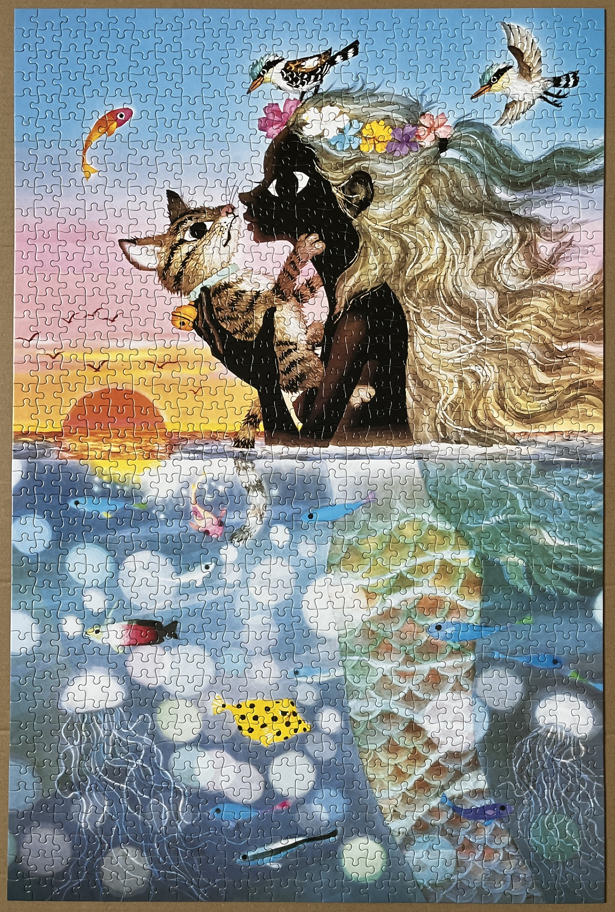
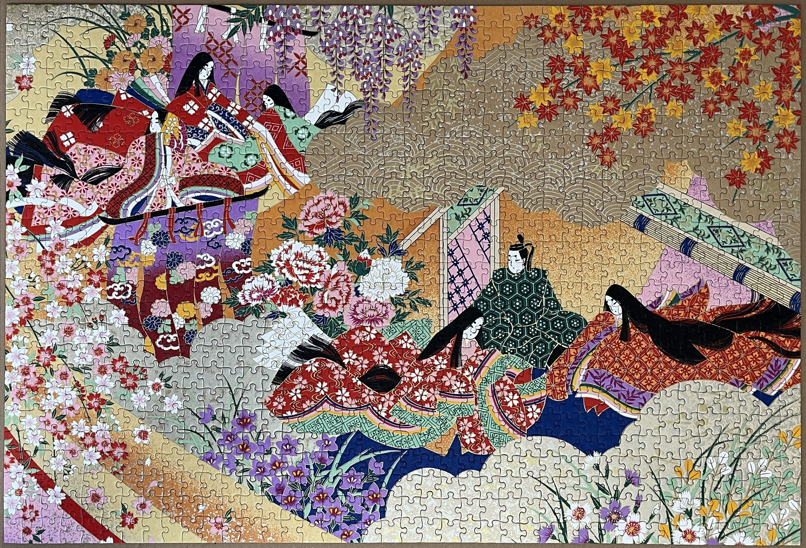
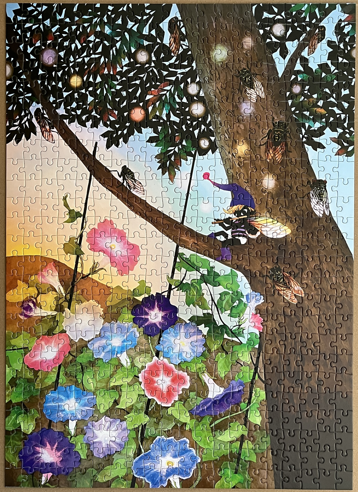
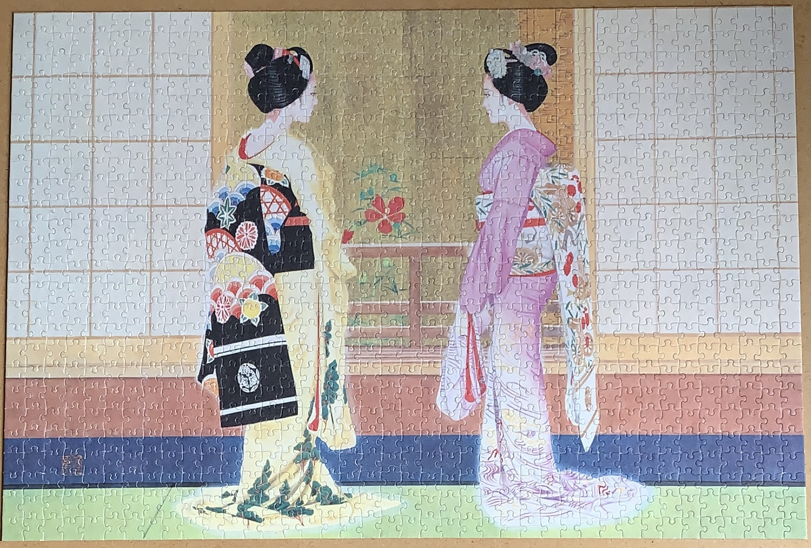

<a href="https://luffm.github.io/Jigsaw-Puzzles/">Jigsaw Puzzles</a>

## Miracle of Love in the Sunset (Seiji Fujishiro)
2026-04-01 

 1000 pieces

## Tale of Genji
2026-03-21 

 1000 pieces

## Morning Glory, Summer Cicadas (Seiji Fujishiro)
2026-01-25 

 750 pieces

## Arcana Rose (Shu)
2025-04-02 

 1000 pieces

## Symphony of Rustling Leaves (Seiji Fujishiro)
2021-09-02 

 1000 pieces

## Futari Maiko
2021-03-11 

 1000 pieces

<a href="https://luffm.github.io/Jigsaw-Puzzles/">Jigsaw Puzzles</a>

